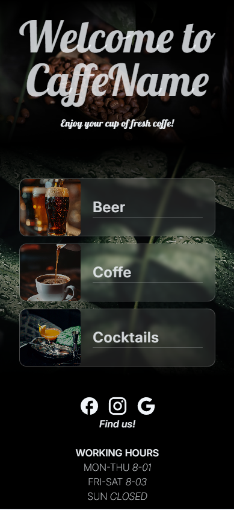
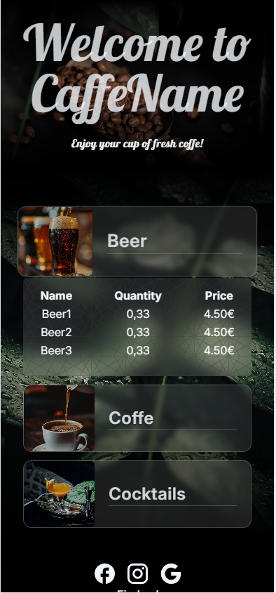
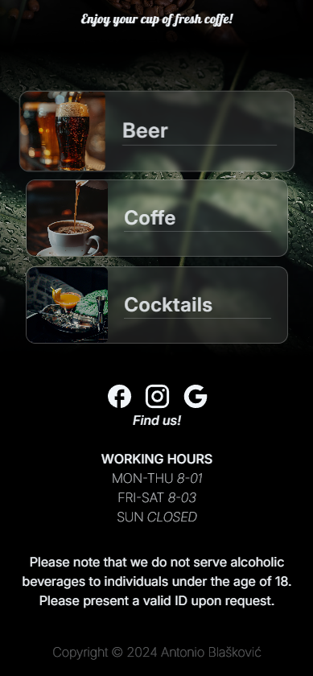

# QR CODE DIGITAL MENU

---

This is my first project using React.The idea is to build digital menu app, with items and categories stored in database.
Frontend is built using Vite and React and TailwindCSS and backend is built using Express.js and PostgreSQL.

---

## App images

 

> Work in progress!
